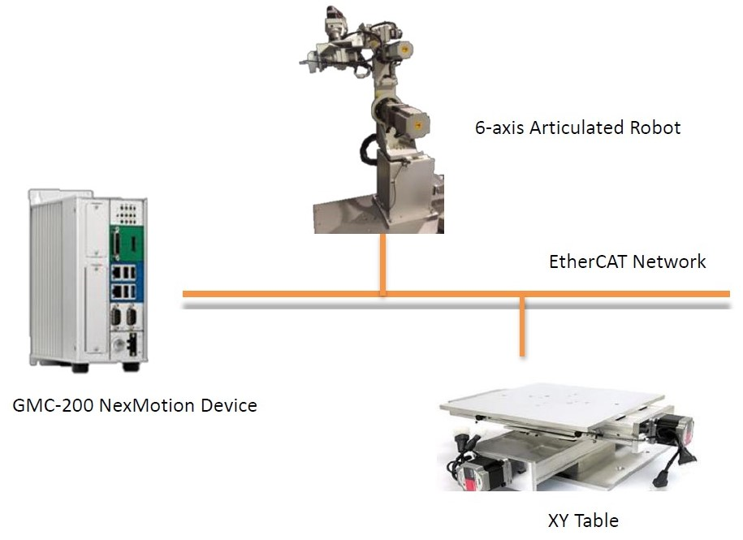
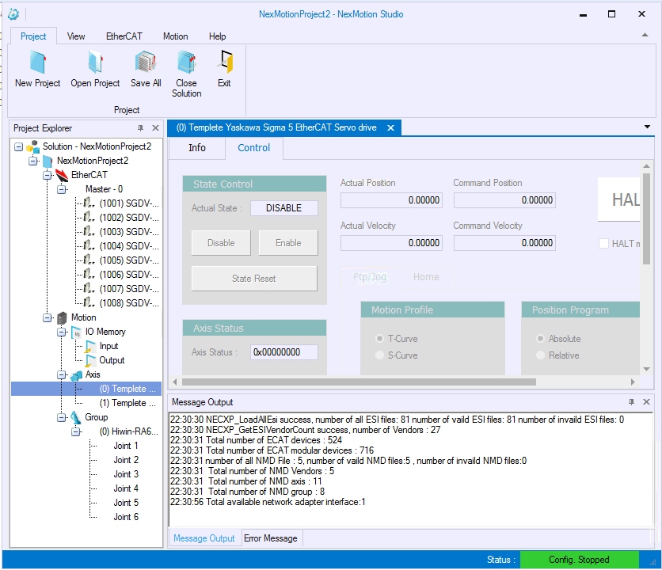
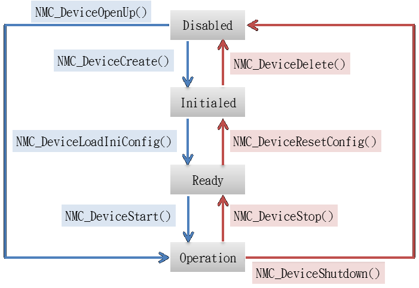
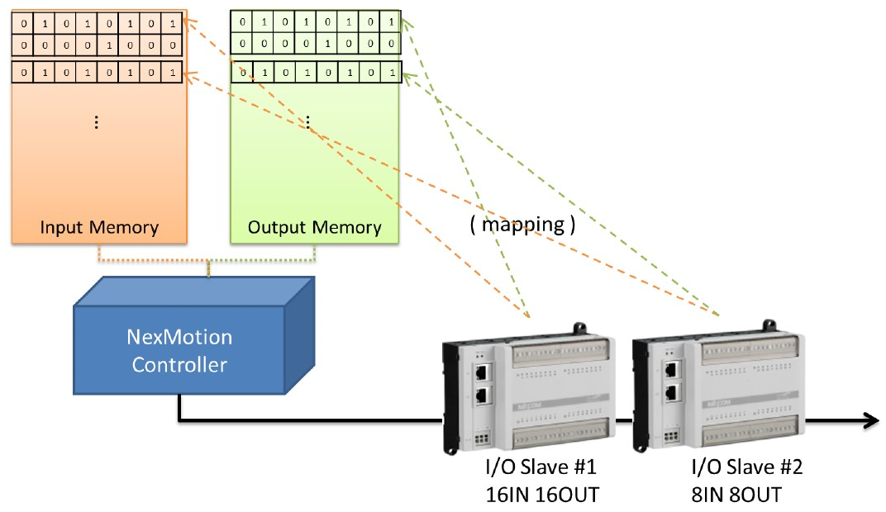
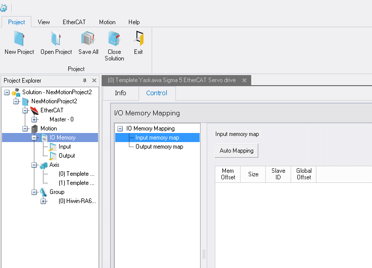
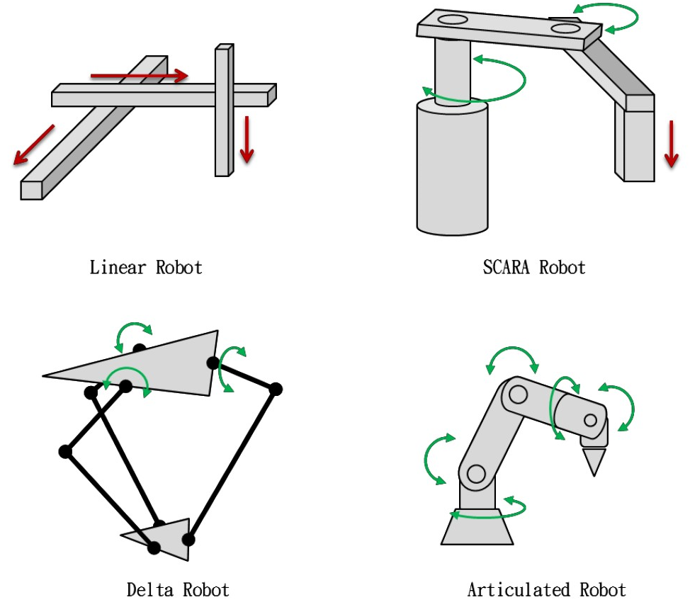

# User Manual {#UserManual}

[TOC]


# 1.Programming Principles {#ProgrammingPrinciples}

The basic development procedure of the NexMotion application is described as follows:

1. Plan the control system
2. Configure and test the controlled system with the NexMotion Studio
3. Generate the configuration file (NCF file) of the controlled system with the NexMotion Studio
4. Develop the control program
5. Compile and debug the control program
6. Test and fine tune the control program





The first 3 steps aim to confirm the following items:
1. The installation and wiring of the controlled system, such as the installation of the servo motor,
the operations of the I/O devices, etc., and
2. The axis control parameters controlled with the NexMotion Studio for the equipment operation.
For example, a controlled system composed of a 6-axis articulated robot and a set of 2-axis XY
table can be controlled with the NexMotion Studio not only to set the mechanism parameters,
units, acceleration/deceleration, and other configurations, but also to perform the homing,
point-to-point and other motions to check if the motion direction, unit moving distance, and
others are in compliance with the system plan. Please refer to the `NexMotion Studio User Manual`
for the usage of the NexMotion Studio.

After the above steps are completed, the configuration files will be generated in the default system
path ( `C:\\Nexcom\`). The files in the path shall not be modified to avoid any undesired system
The 4th step, develop the control program , indicates the control program developments based on the
library provided by the `NexMotion`. The program can issue commands to the device by calling APIs to
complete each applications. The following sections will describe the library functionalities
systematically, including:

1. System operations
2. I/O control,
3. Axis control, and
4. Group control.

These classes of these APIs can be understood based on the naming rule of such APIs. For example:
the APIs with the prefix **NMC_Device** are the System Operations class, the APIs with the prefix
**NMC_Axis** are related to the Axis Control, the APIs with the prefix **NMC_Group** are related to the
Group Control, and so on. Moreover, the extension applications can be developed by referring to the
sample programs provided under the installation folder.




## 1.1. System Operations {#SystemOperations}

The section describes the following items:
1. System initialization,
2. Watch dog, and
3. Debugging.

### 1.1.1. System Initialization

The system initialization shall be performed before starting to use the NexMotion Library, the simplest way
is to call the function [NMC_DeviceOpenUp()](@ref NMC_DeviceOpenUp). A device identification (ID) will be returned after the
successful initialization, and it be used to control the device.
A C sample program shows the system open up and shut down as follows:

```c
#include "NexMotion.h"
#include "NexMotionError.h"
int main()
{
    RTN_ERR ret;
    I32_T devType = NMC_DEVICE_TYPE_ETHERCAT;
    I32_T devIndex = 0;
    I32_T devID;
    ret = NMC_DeviceOpenUp( devType, devIndex, &devID );
    if ( ret != ERR_NEXMOTION_SUCCESS)
    {
        // Error handling...
    }
    // Device is start up successfully.
    // Do Something
    // Support to write codes for control
    NMC_DeviceShutdown( devID );
    return 0
}
```

[NMC_DeviceOpenUp()](@ref NMC_DeviceOpenUp) is a `blocked` function. It will perform the system initialization processes,
including:

1. Establish a device , and generate the device identification (ID),
2. Load the configuration file (NCF file), and
3. Open up the device communication.

The above processes may cost several seconds. After the function returns successfully, the following
processes can send commands to the axes or groups. In addition, the Library also supports a non blocked function, [NMC_DeviceOpenUpRequest()](@ref NMC_DeviceOpenUpRequest). The function can return immediately after called. The device can also receive the same commands and perform the above open up processes. After completing these processes, the [device state](@ref Device_State) will transfer to **OPERATION** , and [NMC_DeviceGetState()](@ref NMC_DeviceGetState) can be used to check the state by polling or [NMC_DeviceWaitOpenUpRequest()](@ref NMC_DeviceWaitOpenUpRequest) can be used to wait for the open up completion.

### 1.1.2. Device Shutdown

[NMC_DeviceShutdown()](@ref NMC_DeviceShutdown) can be used to shut down the device . After the function is called, the device will close communications immediately, so that users shall pay attention to the shutdown process . For example, users can call [NMC_DeviceShutdown()](@ref NMC_DeviceShutdown) to shut down the device completely after confirming all device motions are stopped.

### 1.1.3. Advanced System Initialization

The aforementioned procedure is easy and quick for the general initialization. However, some parameters may be configured before the system opens up. The system initialization can be achieved by separating the procedure as follows:

```c
#include "NexMotion.h"
#include "NexMotionError.h"
int main()
{
    RTN_ERR ret;
    I32_T devType = NMC_DEVICE_TYPE_ETHERCAT;
    I32_T devIndex = 0;
    I32_T devID;
    ret = NMC_DeviceCreate( devType, devIndex, &devID );
    if ( ret != ERR_NEXMOTION_SUCCESS)
    {
        // Error handling
    }

    ret = NMC_DeviceLoadIniConfig( devID );
    if ( ret != ERR_NEXMOTION_SUCCESS )
    {
        // Error
    }

    // Do something here...
    // Parameter

    ret = NMC_DeviceStart( devID );
    if ( ret != ERR_NEXMOTION_SUCCESS)
    {
        // Error
    }

    // Device is start up successfully.
    // Do something...
    // ...

    NMC_DeviceShutdown( devID );
    return 0;
}
```

The separation initialization procedure shall call the 3 APIs in order:
1. [NMC_DeviceCreate()](@ref NMC_DeviceCreate)

2. [NMC_DeviceLoadIniConfig()](@ref NMC_DeviceLoadIniConfig)

3. [NMC_DeviceStart()](@ref NMC_DeviceStart)

The purpose is transfer the [device state](@ref Device_State) to **OPERATION**. The below figure shows the device state transitions and related functions.




The device states can be getting by function [NMC_DeviceGetState()](@ref NMC_DeviceGetState)

### 1.1.4. Watch Dog Timer  {#WatchDogTimer}

  The watch dog timer is a dedicated timer of the device. After the timer starts, the application
shall reset the value of timer within a specific period. Otherwise, if the timer reaches the configured
time, the device will perform the corresponding actions for system shutdown automatically.
  The function is a protective measure to avoid the application crash or the system failure due to
other programs. In case of the system failure, the device will enable the shutdown process because
the timer is timeout when application cannot be reset and.

  If the timer is enabled during the debugging phase of development stage, the debug process may interrupt the program. Some undesired ( cases may occurred since the timer is timeout and the system is shut down. Therefore, it is recommended to disable the function at the development stage and enable the function after the development completion f or additional protection.
  Generally, the watch dog timer is used by enabling a system timer interrupt or creating an
independent thread. [NMC_DeviceWatchdogTimerEnable()](@ref NMC_DeviceWatchdogTimerEnable) is used to enable the watch dog timer , and
[NMC_DeviceWatchdogTimerReset()](@ref NMC_DeviceWatchdogTimerReset) is used to reset such timer. The reset may be two times or more
as frequent as the configured time. [NMC_DeviceWatchdogTimerDisable()](@ref NMC_DeviceWatchdogTimerDisable) is used to disable the timer.


An example is shown as follows:

```c
#include "NexMotion.h"
#include "NexMotionError.h"
#include <Windows.h>

I32_T gThreadCtrl = 1;

DWORD WINAPI WatchDogTimerResetThread(_In_ LPVOID lpParameter )
{
    I32_T devId = *(I32_T *)lpParameter;
    I32_T timeoutMs = 1000;
    DWORD sleepMs = timeoutMs / 2;
    NMC_DeviceWatchdogTimerEnable( devId, timeoutMs, 0);
    while ( gThreadCtrl == 1)
    {
        NMC_DeviceWatchdogTimerReset( devId );
        Sleep( sleepMs );
    }
    NMC_DeviceWatchdogTimerDisable( devId );
    return 0;
}

int main()
{
    RTN_ERR ret;
    I32_T devType = NMC_DEVICE_TYPE_ETHERCAT;
    I32_T devIndex = 0;
    I32_T devID;
    HANDLE threadHandle;
    ret = NMC_DeviceOpenUp( devType, devIndex, &devID );
    if ( ret != ERR_NEXMOTION_SUCCESS )
    {
        // Error handling ...
    }
    threadHandle = CreateThread(NULL, 0, WatchDogTimerResetThread, &devID, 0, NULL);
    if ( threadHandle == NULL)
    {
        // Error handling ...
    }
    // Device is start up successfully.
    // Do something ...
    // ...
    // Try to stop WDT thread
    gThreadCtrl = 0;
    WaitForSingleObject( threadHandle, INFINITE );

    NMC_DeviceShutdown( devID );

    return 0;
}
```


### 1.1.5. Debugging

  To assist developers to debug the application, there are two measures, system messages and API
trace.


## 1.2. I/O Control {#IO_Control}

  NexMotion provides flexible and high velocity I/O control as the memory access. Developers
shall map the memory address of I/O devices onto the virtual memory with NexMotion Studio, and
then they can control or get/set the I/O devices by accessing the memory. Please refer to the
NexMotion Studio user manual for the configurations.








After configurations, the following functions can be used to access or control the I/O devices:
1. [NMC_ReadInputMemory()](@ref NMC_ReadInputMemory)
2. [NMC_ReadOutputMemory()](@ref NMC_ReadOutputMemory), and
3. [NMC_WriteOutputMemory()](@ref NMC_WriteOutputMemory)

Note: The update rate of I/O memoryThe update rate of I/O memory is once per 10 ms (100Hz). Therefore, the functions may not is once per 10 ms (100Hz). Therefore, the functions may not support responses immediately if the frequency of digital output calling is higher than 100Hz.support responses immediately if the frequency of digital output calling is higher than 100Hz.


## 1.3. Axis Control {#AxisControl}

  Different from the group axis for coordination operations in the mechanism, the single axis
described in the section is independent for the corresponding to the mechanical structure.
Functionally, the contents of this section are mainly divided into three major parts. The first part is the
axis configurations, including the unit and the software limit protection configurations. The second
part is the motion control functions, including excitation, point-to-point motion JOG motion , stop
motion and the change on fly function. Finally, the third part mainly focuses on reading the
information related to the axis motion, including reading the current status and motion information of
axis.


## 1.4. Group Control {#GroupControl}

  NexMotion can define some axes as a group. A group represents a mechanism or a robot with a
specified structural relationship. Now, NexMotion can support these industrial robots as follows:




### 1.4.1. Group Configuration {#GroupCofig}

  The mechanism configuration file can be imported with the NexMotion Studio through the steps
as follows:

1. Import a Mechanical Description ( NMD ) file with the NexMotion Studio.

2. Map the servo motor to each axis in the group.

3. Test the group and at the same time the configuration file of the controlled system (NCF file) will
    be generated.
    Please refer to the user manual of the NexMotion Studio for the detail procedure.

A group can also be defined by manual. First, a similar mechanism configuration profile can be imported with NexMotion Studio as the template. Then the related configurations of the template can be adjust/modified to meet the actual mechanism through the steps as follows:

1. Import a Mechanical Description ( NMD ) file with the NexMotion Studio as a template.
2. Modify the unit parameters of each axis (Please refer to the unit configuration of axis.
3. Modify the parameters of mechanism kinematics (Please refer to the Mechanism Kinematics
   Configurations.
4. Map the servo motor to each axis in the group.
5. Test the group and generate the configuration file of the controlled system (NCF file).


# 2. Device Parameters {#DeviceParameters}

## 2.1. System Parameters {#SystemParameters}

| Param. Num. | Sub. Index | Data Type | Description               | Range                 | Remark     |
| :---------: | :--------: | --------- | :------------------------ | :-------------------- | ---------- |
|    0x00     |     0      | I32_T     | Motion cycle time (us).   | 1000~4000 microsecond | (\*1)(\*3) |
|    0x01     |     0      | I32_T     | Number of activated axis  | 0~64                  | (\*1)      |
|    0x02     |     0      | I32_T     | Number of activated group | 0~64                  | (\*1)      |

(\*1): The parameter is effective after the system is started. During the system starting , the parameter
cannot be modified.

(\*2): The parameter is effective after the function is enable. The modification in another period
cannot be effective immediately.

(\*3): The configurable range is depended on the controller

(\*4): Read only.

